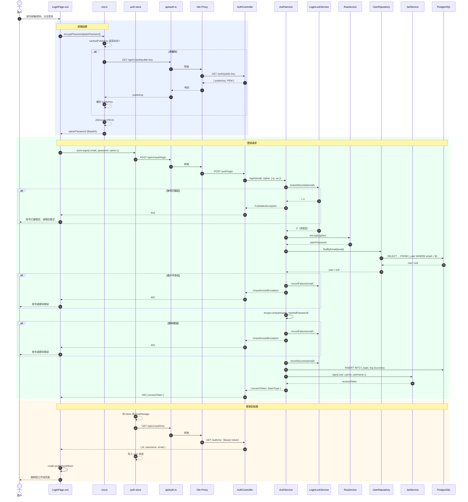

# it技术文档

> 梳理当前功能点

## 登陆

页面地址：/login
密码非明文传播。生产上可以使用https做加密传播。

### 密码加密

1. 获取公匙，进行加密 `/api/v1/auth/public-key`
2. 登陆 `/api/v1/auth/login`
3. 登陆不做任何校验

```mermaid
sequenceDiagram
    autonumber
    actor User as 用户
    participant Page as LoginPage.vue
    participant RsaUtil as rsa.ts
    participant AuthStore as auth store
    participant API as api/auth.ts
    participant Vite as Vite Proxy
    participant Controller as AuthController
    participant AuthSvc as AuthService
    participant LockSvc as LoginLockService
    participant RsaSvc as RsaService
    participant UserRepo as UserRepository
    participant JwtSvc as JwtService
    participant DB as PostgreSQL

    User->>Page: 填写邮箱/密码，点击登录

    rect rgb(235, 242, 255)
        Note over Page,RsaUtil: 前端加密
        Page->>RsaUtil: encryptPassword(plainPassword)
        RsaUtil-->>RsaUtil: cachedPublicKey 是否存在?
        alt 未缓存
            RsaUtil->>API: GET /api/v1/auth/public-key
            API->>Vite: 转发
            Vite->>Controller: GET /auth/public-key
            Controller-->>Vite: { publicKey: PEM }
            Vite-->>API: 响应
            API-->>RsaUtil: publicKey
            RsaUtil-->>RsaUtil: 缓存 publicKey
        end
        RsaUtil-->>RsaUtil: JSEncrypt PKCS#1 v1.5 加密
        RsaUtil-->>Page: cipherPassword (Base64)
    end

    rect rgb(235, 255, 242)
        Note over Page,DB: 登录请求
        Page->>AuthStore: store.login({ email, password: cipher })
        AuthStore->>API: POST /api/v1/auth/login
        API->>Vite: 转发
        Vite->>Controller: POST /auth/login
        Controller->>AuthSvc: login(email, cipher, { ip, ua })

        AuthSvc->>LockSvc: lockedSeconds(email)
        alt 账号已锁定
            LockSvc-->>AuthSvc: > 0
            AuthSvc-->>Controller: ForbiddenException
            Controller-->>Page: 403
            Page-->>User: 账号已被锁定，请稍后重试
        end

        LockSvc-->>AuthSvc: 0（未锁定）
        AuthSvc->>RsaSvc: decrypt(cipher)
        RsaSvc-->>AuthSvc: plainPassword

        AuthSvc->>UserRepo: findByEmail(email)
        UserRepo->>DB: SELECT ... FROM t_user WHERE email = $1
        DB-->>UserRepo: row / null
        UserRepo-->>AuthSvc: user / null

        alt 用户不存在
            AuthSvc->>LockSvc: recordFailure(email)
            AuthSvc-->>Controller: UnauthorizedException
            Controller-->>Page: 401
            Page-->>User: 账号或密码错误
        end

        AuthSvc->>AuthSvc: bcrypt.compare(plain, hashedPassword)
        alt 密码错误
            AuthSvc->>LockSvc: recordFailure(email)
            AuthSvc-->>Controller: UnauthorizedException
            Controller-->>Page: 401
            Page-->>User: 账号或密码错误
        end

        AuthSvc->>LockSvc: recordSuccess(email)
        AuthSvc->>DB: INSERT INTO t_login_log (success)
        AuthSvc->>JwtSvc: sign({ sub: userId, username })
        JwtSvc-->>AuthSvc: accessToken
        AuthSvc-->>Controller: { accessToken, tokenType }
        Controller-->>Page: 200 { accessToken }
    end

    rect rgb(255, 248, 235)
        Note over Page,DB: 登录后处理
        AuthStore-->>AuthStore: 存 token 到 localStorage
        AuthStore->>API: GET /api/v1/auth/me
        API->>Vite: 转发
        Vite->>Controller: GET /auth/me（Bearer token）
        Controller-->>Page: { id, username, email }
        AuthStore-->>AuthStore: 写入 user 状态
        Page->>Page: router.push('/workflow')
        Page-->>User: 跳转到工作流页面
    end
```

## 注册

1. 校验用户输入
